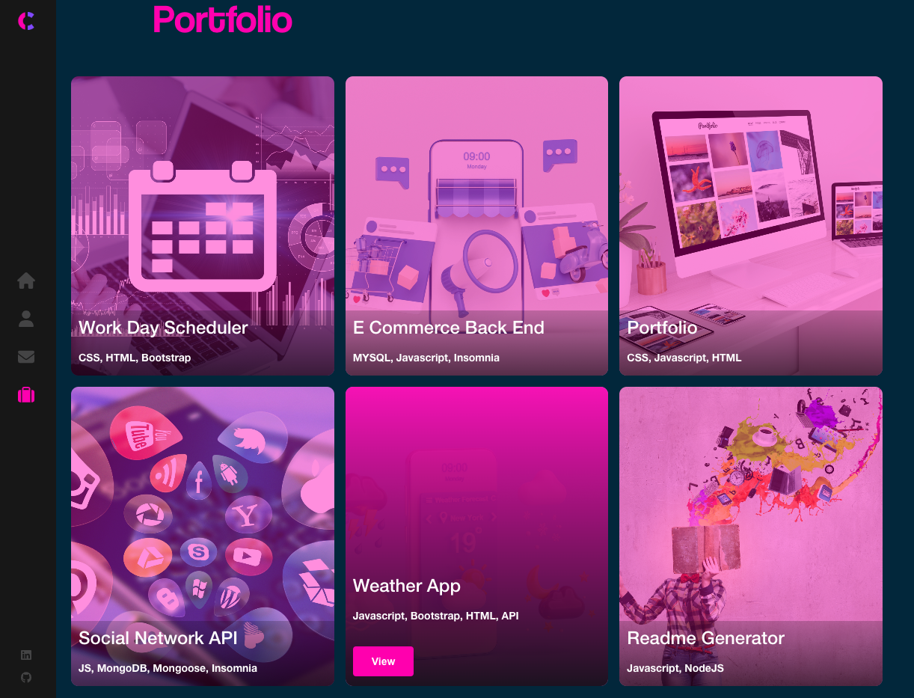
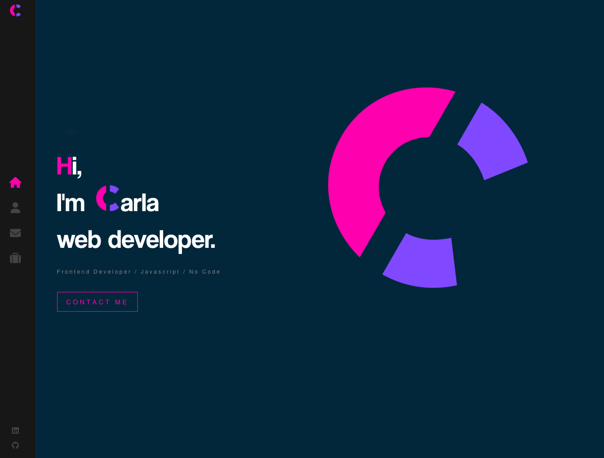

# Portfolio-React

React Portfolio showcasing some of my work

# Getting Started with Create React App

This project was bootstrapped with [Create React App](https://github.com/facebook/create-react-app).

## Available Scripts

In the project directory, you can run:

### `npm start`

Runs the app in the development mode.\
Open [http://localhost:3000](http://localhost:3000) to view it in your browser.

Several different packages are used in this project:

@emailjs/browser": "^3.11.0",

@fortawesome/free-brands-svg-icons": "^6.4.0",
   
@fortawesome/free-solid-svg-icons": "^6.4.0",

@fortawesome/react-fontawesome": "^0.2.0",

animate.css": "^4.1.1",

loaders.css": "^0.1.2",

I've also used a JSON file to render my portfolio data (images, title, description, url)

To view deployment: https://www.carla-portfolio-project.web.app

Screenshot: 

